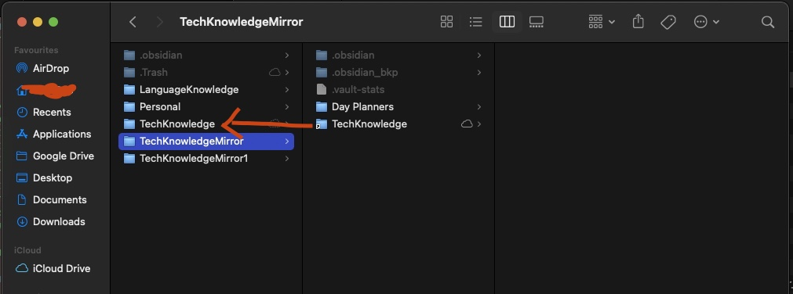

## Obsidian Mirror Plugin

Here we are, you have multiple monitors (sometimes I have up to 6 monitors) and you want to be 200% productive with Obsidian.

On one monitor you have a file opened and on another monitor you want to have a **full screen** `local graph` that helps you to connect the dots (in your mind)

Why? simply because the local graph in the same Obsidian instance is too small!

I was desperate and fortunately I found a workaround to run multiple instances of Obsidian in the forum using *symlink* [here](https://forum.obsidian.md/t/floating-pop-out-multiple-windows-of-the-same-vault/837/58)
NB: *symlink* to create virtual links. 

After successfully created symlinks `ln -s` you should be able to have a "mirror" Vault which will contain the symlink of the main Vault you want to use.

Here is an example:

Unfortunatelly this solution partially works cause when I switch context from the main Obsidian's instance, there is no way to propagate this to a second obsidian's instance.

So I created (in several hours) this plugin that syncs the active file among different Obsidian's instances.

Here's a quick gif that shows how it works (right side the main Obsidian'instance, left side the secondary *mirror* obsidian's instance)

This plugin is far from being perfect. I rely on the community to enhance it and make it more rubust.

In the meantime, if you are not a developer, you can FINALLY use the precious **local graph** on a different monitor.

Enjoy!